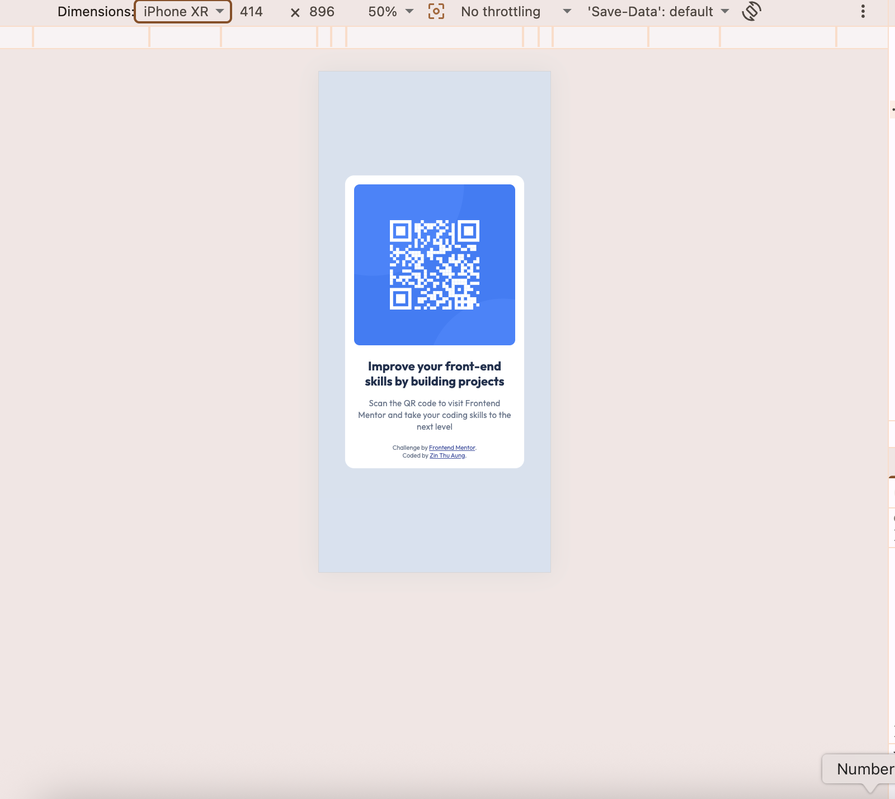
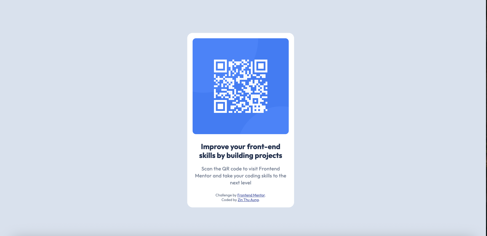

# Frontend Mentor - QR code component solution

This is a solution to the [QR code component challenge on Frontend Mentor](https://www.frontendmentor.io/challenges/qr-code-component-iux_sIO_H). Frontend Mentor challenges help you improve your coding skills by building realistic projects. 

## Table of contents

- [Overview](#overview)
  - [The Challenge](#the-challenge)
  - [Screenshot](#screenshot)
  - [Links](#links)
- [My process](#my-process)
  - [Built with](#built-with)
  - [What I learned](#what-i-learned)
  - [AI Collaboration](#ai-collaboration)
- [Author](#author)

## Overview

### The Challenge

The objective of this challenge was to build out a clean, modern QR code component card and get it looking as close to the original design files as possible. 

The core focus of this project was mastering fundamental CSS skills, including:
- Structuring a clean UI layout using semantic HTML5 markup.
- Perfecting absolute viewport layout alignment (centering content perfectly both horizontally and vertically).
- Replicating exact design specifications using precise text fonts, weights, colors, and border-radius properties.
- Ensuring the layout naturally scales and responds beautifully across different screen widths without breaking.

### Screenshot

### Links

- Solution URL: [https://github.com/ZinThuAung-LAB/Frontend-Mentor.git/](https://github.com/ZinThuAung-LAB/Frontend-Mentor.git/)
- Live Site URL: [https://zinthuaung.github.io/QRCode-Component/](https://zinthuaung.github.io/QRCode-Component/)
## My process

### Built with

- Semantic HTML5 markup
- CSS Custom Properties (Variables)
- Flexbox layout structure
- Universal reset selectors
- Google Fonts Integration

### What I learned

During this project, I ran into classic CSS structural layout challenges and learned a ton about browser default behaviors, universal viewport handling, and alignment.

Key takeaways include:
1. **The HTML Viewport Stretch:** I learned that setting `min-height: 100vh` on the `body` works perfectly only when the root `html` element layout space isn't collapsed by browser defaults.
2. **Box Sizing Reset:** Utilizing `box-sizing: border-box` is critical to prevent padding values from breaking the symmetrical centering of layout components.
3. **Flexbox Auto Margins:** I mastered how to use `margin-top: auto;` inside a vertical flex column direction to elegantly anchor the attribution footer line elements to the base boundary without altering fixed margins.
